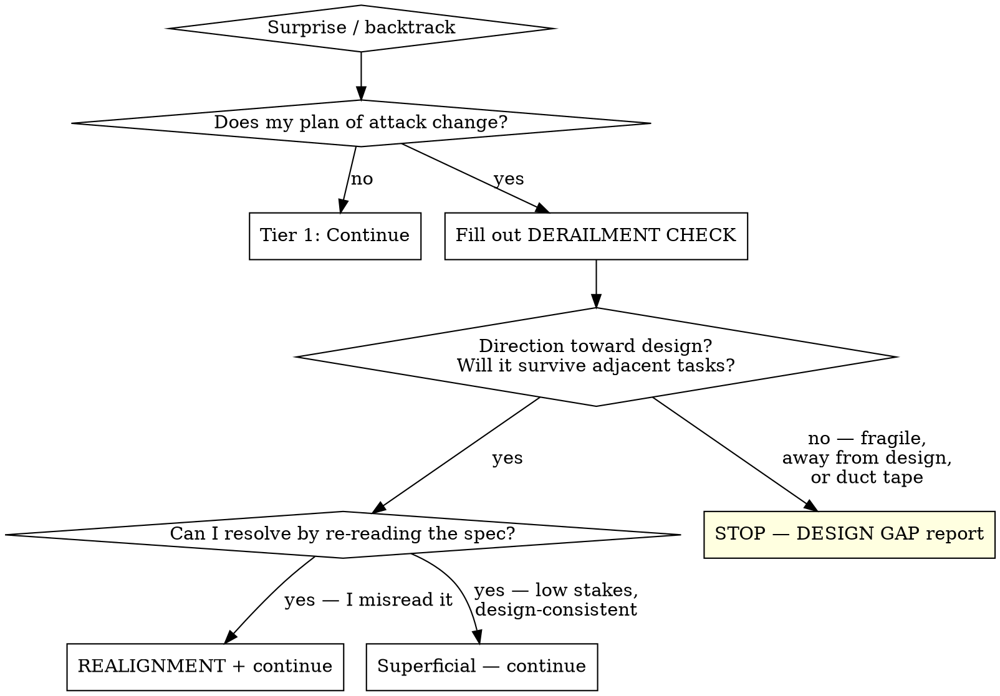

# Derailment Triage

Detect when execution is going off the rails, classify the confusion, and either self-correct or escalate before producing fragile code.

## Overview

Three categories of confusion arise during plan execution:

- **Superficial surprise** — A minor implementation detail is different than expected (missing helper, renamed variable, moved file). Approach unchanged. Continue.
- **Task misunderstanding** — The agent misread the spec. The design is fine; the agent's mental model was wrong. Re-read, realign, continue.
- **Design gap** — The design didn't account for something real. Continuing means writing fragile code that moves away from the design's intent. Stop and escalate.

## Two-Tier Triage



### Tier 1: No ceremony

Implementation details differ from expectations but the approach is unchanged. Examples: missing helper function, different variable name, file in unexpected location, slightly different API signature. **Continue without interruption.**

### Tier 2: Structured check

Any time you reconsider *how* to solve the problem, fill out:

```
DERAILMENT CHECK:
- Surprise: [What I expected vs what I found]
- Intended change: [What I'm about to do differently]
- Direction: [Toward / Away from / Orthogonal to] the design
- Fragility: [Will this hold up when adjacent tasks execute, or is it duct tape?]
- Verdict: [CONTINUE — task misunderstanding, realigning | CONTINUE — superficial, design-consistent | STOP — design gap]
```

**Direction** and **fragility** are the key gates. Writing "away from" or "duct tape" and then "CONTINUE" is a red flag — the format makes rationalization visible.

## Verdict Handling

### CONTINUE — task misunderstanding

You misread the spec. Fill out:

```
REALIGNMENT:
- Was doing: [What I thought the task was]
- Should be doing: [What the spec actually says]
- Key misunderstanding: [What I got wrong]
```

Then proceed. The realignment record is auditable by the orchestrator.

### CONTINUE — superficial, design-consistent

Low stakes, reversible, consistent with the design's direction. Proceed.

### STOP — design gap

The design didn't account for something real. Fill out:

```
DESIGN GAP:
- Task: [What I was implementing]
- Expected: [What the design says / implies]
- Found: [What's actually needed]
- Disconnect: [Why these don't match — the impedance mismatch]
- Attempted: [What I tried, if anything, and why it felt fragile/wrong-direction]
- Decision needed: [What the design needs to address]
```

**In subagent context:** Return status `DESIGN_GAP` with this report. Do not attempt a fix.

**In direct execution:** Stop, present the report to the user, wait for guidance.

**Once you write STOP, you stop.** No "let me just try one thing." You are not qualified to make this design decision.

## Trigger Signals

### Self-monitoring

- "Wait...", "Actually...", "Hmm, that won't work..."
- Deleting/reverting code you just wrote
- Re-reading the same file multiple times looking for something
- Changing approach mid-implementation

### Orchestrator monitoring

When orchestrating subagents, watch for:
- Multiple `NEEDS_CONTEXT` rounds (2+) — may be circling, not self-diagnosing
- Subagent introduces patterns/abstractions not in the design
- Subagent's diff diverges from the plan's described approach
- Subagent modifies files the plan didn't say to touch
- `DONE_WITH_CONCERNS` citing fragility or impedance mismatch

When you spot these, perform a derailment check on behalf of the subagent. Same verdict rules apply.

## Decision Criteria

The key test is not "is this written down?" but:

- **Am I moving toward or away from the design's intent?**
- **Will what I'm writing survive contact with the next task?**

If a decision seems implied by the design, or is low stakes / easy to reverse / doesn't conflict → keep going.

If the code is fragile, there's high impedance mismatch not addressed in the design, or you're implementing things directionally away from the design → design gap.

## Integration

This protocol is designed to be **embedded in execution contexts**, not invoked as a standalone skill. An agent going off the rails is unlikely to pause and invoke a skill. The protocol must already be loaded.

**This file is the source of truth.** Execution prompts embed a condensed excerpt (~150-200 words) containing:
1. The tier 1 vs tier 2 decision rule
2. The DERAILMENT CHECK template
3. The three verdict options
4. The DESIGN GAP format and the stop rule
5. A reference back to this file for edge cases

### Condensed protocol for embedding

The following block is designed to be copied into execution prompt templates:

```
## Derailment Protocol

When you hit a surprise or catch yourself backtracking:

**Tier 1 — Does your plan of attack change?** No → continue, no ceremony needed.

**Tier 2 — Approach is changing.** Fill out before proceeding:

DERAILMENT CHECK:
- Surprise: [expected vs found]
- Intended change: [what you'll do differently]
- Direction: [Toward / Away from / Orthogonal to] the design
- Fragility: [will this survive adjacent tasks, or is it duct tape?]
- Verdict: CONTINUE (task misunderstanding) | CONTINUE (superficial) | STOP (design gap)

If CONTINUE (task misunderstanding), also fill out:
REALIGNMENT: Was doing / Should be doing / Key misunderstanding

If STOP (design gap), fill out and return status DESIGN_GAP:
DESIGN GAP: Task / Expected / Found / Disconnect / Attempted / Decision needed
Do NOT continue implementing after STOP. You are not qualified to make this design decision.

Key test: Am I moving toward or away from the design? Will this survive the next task?
```

### Where to embed

- **subagent-driven-development implementer prompt** — Add the condensed protocol. Add `DESIGN_GAP` as a return status.
- **subagent-driven-development orchestrator** — Add orchestrator monitoring signals. Add `DESIGN_GAP` handling alongside `DONE`, `DONE_WITH_CONCERNS`, `NEEDS_CONTEXT`, `BLOCKED`.
- **executing-plans** — Add the condensed self-check protocol.

## Common Mistakes

| Mistake | Why it's wrong |
|---------|---------------|
| Rationalizing "toward" when it's really "orthogonal" | Orthogonal changes accumulate into drift. If it's not clearly toward, it's suspicious. |
| Treating a design gap as a task misunderstanding | "I just need to re-read the spec harder" — if re-reading doesn't resolve it, it's a gap. |
| Writing STOP then continuing anyway | The whole point is that you stop. "Let me just try one thing" is the failure mode this protocol exists to prevent. |
| Skipping the structured check because "it's obviously fine" | If your approach changed, fill out the check. The format exists to catch rationalization you can't see. |
| Orchestrator ignoring `DONE_WITH_CONCERNS` | Concerns about fragility or impedance mismatch are derailment signals. Read them. |
