# Map of Ongoing Work

*A tactical inventory of in-flight and planned-but-unimplemented work, with
dependencies. This is the input to a strategic roadmap discussion, not the
roadmap itself.*

Sources: `TODO.md`, the design docs under `docs/` (incl. `docs/plans/`), the 9
open PRs, and the current state of `main`. Compiled 2026-06-20.

> **Update 2026-06-21**: the loop memory-effect threading cluster
> (#185, #186, #188, #189, #190) postdates this snapshot. #186 fixes the
> 10 dcc loop tests the #184 merge broke; read §1's PR table with that
> cluster in mind.

---

## 0. Snapshot: where things stand

- **`main` is quiet.** 50 commits total; tip is `ae80622` (2026-04-29). There are
  **no open issues**. Essentially all in-flight work lives in **9 open PRs** and in
  design docs that run ahead of the code. The practical consequence: WIP is high,
  merged progress is low, and several PRs have started to drift from `main`.
- **What is proven on `main` today** (the spine everything else builds on):
  - Value-centric IR (`Value`/`Type`/`Op`/`Block`), types are first-class values;
    `Module` has been removed from the pipeline (`docs/plans/value-compilation.md`).
  - ASM text round-trip (parse ↔ format), heavily tested.
  - **Staging engine**: compile-time constant folding *and* runtime callback thunks
    for dependent types (`number.SignedInteger<%bits>` resolved per-call). This is
    the headline differentiator and it works end-to-end (`Readme.md`).
  - **Toy** pipeline runs end-to-end to JIT (source → AST → Toy IR → structured →
    control_flow → goto → ndbuffer → memory → LLVM → llvmlite).
  - **Effects v1**: `try`/`raise` lowered to `goto` (CPS); generic divergence
    detection (`Diverge` effect, `Value.totality`).
  - **Linearity verifier** (`dgen/ir/verification.py`), wired into every pass's
    pre/post hooks — sound but permissive (treats all block-holding ops as unknown).
  - **goto `%self`/`%exit` convention** fix landed (`docs/plans/goto-self-convention.md`).
  - `builtin.ConstantOp` (generic quote), `pack`/`unpack`, homogeneous→`Array`,
    heterogeneous→`Tuple`.
- **What is *not* on `main` yet** (lives only in PRs/docs): cross-function calls,
  early `return`, `break`/`continue`, autodiff, the linear-Reference memory model,
  `func.recursive`, origins, type-staging. `examples/dcc/passes/` on `main` contains
  only `c_lvalue_to_memory.py` — the rest of the C frontend is unmerged.

---

## 1. Open PRs (tactical / practical)

No open issues. 9 open PRs, grouped by theme. "Drift" = age relative to `main`'s
2026-04-29 tip; older PRs likely need rebase and may overlap already-landed work.

### C frontend (`dcc`) — a stacked chain, the largest cluster

| PR | Adds | Status / dependencies |
|----|------|------------------------|
| **#165** | Cross-function calls: lower C calls → `function.CallOp`; resolve same-file `ExternOp`→`FunctionOp`; per-`(block,name)` alloca scoping | Base = `main`. **Foundation of the dcc chain.** Self-recursion deliberately left as `ExternOp` (blocked on `func.recursive`); mutual recursion xfail. |
| **#169** | `return` inside control flow (Brick 6.5): `c.c_return` becomes `Never`-typed; codegen emits `ret`; core change: treat any `Never`-typed op as a BB terminator | **Stacked on #165** — merges only after it. Known gap: `if (x) return a; else return b;` (every branch diverges → unreachable merge phi) is xfail; needs merge-elision in `control_flow_to_goto`. |
| **#128** | `break`/`continue` via `builtin.Never` + `control_flow.Break/ContinueOp` + `ResolveJumpMarkers` nested pass | Older (2026-04-07). Introduces `Never` and `CReturnOp`-as-`Never` — **overlaps the model #169 depends on**; needs reconciliation (which PR is the source of truth for `Never`/early-exit?). |

### Memory model

| PR | Adds | Status / dependencies |
|----|------|------------------------|
| **#184** | `memory.State` effect + `memory.Reference` as `Linear` + `Handler`; load/store/deallocate thread linearly; drop count from allocate; remove `memory.offset`; add non-linear `memory.Buffer` family; migrate ndbuffer/record/toy/dcc lowerings; drop `record.set` | Base = current `main` tip — **the freshest PR.** This is the concrete first step of the `docs/effects.md` origins plan (replace mem tokens). Overlaps recent `record`/`unpack`/`PackOp` work on `main`; large surface area. |

### Toy / autodiff

| PR | Adds | Status / dependencies |
|----|------|------------------------|
| **#102** | `diff` dialect + `GradOp` + reverse-mode autodiff pass for Toy (add/mul/transpose/reshape/constant; polynomials to x³) | Older (2026-03-29), behind `main`. Self-contained; needs rebase. |

### Core IR / call design

| PR | Adds | Status / dependencies |
|----|------|------------------------|
| **#139** | Make `function.call`'s callee an **operand**, not a parameter (fixes stage bumps for higher-order fns) — this is **Option A** from `docs/block-scoping.md` §3.6 | Older (2026-04-09). **Design fork**: §3.6 *recommends Option C* (block params). Interacts directly with `func.recursive`. Must be decided before/with recursion work. |

### Tests / infra / docs / viz

| PR | Adds | Status / dependencies |
|----|------|------------------------|
| **#97** | Function-reference tests + register all dialects in test `conftest` | Older (503-test era). Likely partly subsumed; rebase & re-evaluate. |
| **#135** | Docs consolidation 13→8 files; **deletes** `plan.md`, `staging.md`, `staged-computation.md`, `block-scoping.md`, `control-flow.md`, etc. | **Stale** (664-test era, pre-effects/linearity/goto-convention). Conflicts with docs that later work relies on. Do not merge as-is; redo against current docs. |
| **#43** | Manim visualization of the transpose-elimination pass (trace + scene) | Oldest (2026-03-19). Demo/marketing artifact; orthogonal. |

**Tactical observations on the backlog**

- **The dcc chain is the dependency-heaviest cluster**: #128 / #165 / #169 all touch
  `Never`, early exit, and `control_flow_to_goto`, and partly overlap. They need to be
  ordered and de-duplicated, not landed independently.
- **#184 is the live memory-model migration** and the only PR based on current `main`;
  it is the gateway to the origins design.
- **Several PRs (#43, #97, #102, #128, #135, #139) predate large `main` changes** and
  carry rebase + possible-supersession risk. A triage pass (rebase / close / redo) is
  its own unit of work.
- **#139 is not just a refactor** — it picks a side in the unresolved `call`/recursion
  design fork.

---

## 2. Planned but unimplemented (from `TODO.md` + design docs)

Grouped by subsystem. Each item notes its source and, where relevant, what blocks it.

### A. IR core & scoping

- **`func.recursive`** — recursive functions currently violate the DAG property
  (`block.ops` follows the callee edge back into the body). `%self` as a block
  parameter breaks the cycle. *Source: `TODO.md`, `docs/block-scoping.md` §3.1.*
  **Keystone blocker** — see §3.
- Make **`Block` a `Value`**. *(`TODO.md`)*
- Values **track their uses** (forward iteration, fast `replace_uses`). *(`TODO.md`)*
- Make `transitive_dependencies` **iterative** (explicit stack) — memory-token chains
  blow Python's recursion limit on large functions (dcc needs `setrecursionlimit(50000)`
  for sqlite3). *(`TODO.md`, C compiler requests)*

### B. Staging & compilation interface

- `compile(value) -> Constant` is marked **Implemented** (`docs/plans/value-compilation.md`),
  but its dependents are **not** finished:
  - **Staging cleanup** (`docs/plans/staging-cleanup.md`): strip codegen/ctypes/llvmlite
    internals out of `staging.py` (~560→~50 lines); `_jit_evaluate`, `_specialize_ifs`,
    `_extern_declarations`, callback-thunk LLVM construction, etc. should go away.
  - **Type staging** (`plan.md` Phase 4): make `op.type` a staged value so staging
    **subsumes shape inference** and removes `resolve_constant`. `shape_inference.py`
    still exists as a separate pass → not done.
- **Batch subgraph resolution** — resolve independent same-stage boundaries in one
  mini-module / JIT call. *(`TODO.md` Staging, `plan.md` 5a)*
- **Less packing/unpacking** churn in the staging loop. *(`plan.md` 5c)*

### C. Effects, linearity, memory & origins

- **Origins** (`docs/effects.md`) — the full successor to mem tokens: linear evidence
  for memory ops, destructor obligations, forest-based alias analysis, ownership
  transfer on return. **#184 (Linear Reference) is step 1**; origins are the larger
  remainder. *Big.*
- **Per-op linearity contract framework** — `_has_known_block_semantics` returns
  `False` unconditionally; every block-holding op is treated as unknown. A real
  contract lets ops declare precise capture-consumption. *(`TODO.md`, `docs/linear_types.md`)*
- **Effect subtyping** — `Raise<E>` should be a sub-effect of `Diverge`; until then
  `RaiseHandler` redundantly declares both. *(`TODO.md`)*
- **Loop-carry linearity** — verifier doesn't model the carry-pair relationship; a
  linear loop carry would be wrongly flagged. *(`TODO.md`, `docs/linear_types.md`)*
- **Mark `Origin` as `Linear`** once origins land (verifier picks it up automatically).
- **Partial-op linearity rule** — partial ops must drain in-scope linear values before
  divergence; shape TBD. *(`docs/linear_types.md`)*
- **Effects across function boundaries** and **actor effects** (`Send`/`Spawn`/
  `Supervise`) — explicit non-goals for v1 (`docs/effects.md`).

### D. Type system

- **Constraint verification** — `ExpressionConstraint` and `HasTypeConstraint` are
  stored but silently skipped; only `HasTraitConstraint` is verified. Needs an
  evaluator (operand/param refs, attribute access like `input.shape.rank`, comparisons,
  arithmetic). xfail tests in `test/test_trait.py`. *(`TODO.md`)*
- **Subtyping** generally (enables the effect-subtyping item above). *(`TODO.md`)*
- **Recursive types** — `_make_layout` loops forever on mutually-recursive type defs;
  needs cycle-detection auto-boxing or an explicit boxed annotation. *(`TODO.md`)*
- **Existentials** — runtime `pack_existential` / `unpack_existential` ops (today
  `Some`/`Any` only have constant construction); plus making compound constants a tree
  of real `Value`s so `transitive_dependencies` walks them (removes dict-peeking). *(`TODO.md`)*
- **FatPointer layouts** for `String`/`List` (runtime-flexible sizes), then **list-typed
  op fields** use `List` natively. *(`plan.md` Phase 2, 5b)*
- **`SignedInteger`/`UnsignedInteger` layout** parameterized on `bits` (today always
  64-bit `Index`; `llvm_type` works around it). *(`TODO.md` Codegen)*
- **DTypes**. *(`TODO.md`, `plan.md` not-planned)*

### E. Control flow & codegen

- **Every-branch-diverges merge elision** in `control_flow_to_goto` (the #169 known
  gap) — needed for `if/else`-both-return and for dcc mutual recursion.
- **`IfOp` / `goto.ConditionalBranchOp` require `Boolean`** conditions (codegen
  currently fakes it via `icmp ne 0`). *(`TODO.md`)*
- **Proper "is terminator" check** to replace the `isinstance(result.type, Never)`
  proxy in `_make_branch_label` / `NormalizeRegionTerminators`. *(`TODO.md`)*
- **`ChainOp` type forwarding** — when a pass mutates `op.type` (e.g. shape inference),
  wrapping ChainOps keep the stale type. *(`TODO.md`)*
- **`Executable.run()` lifetime bug** — temporary input `Memory` can be GC'd before a
  pointer result is read; fix by attaching input memories to `host_refs`. *(`TODO.md`)*

### F. Frontends / examples

- **dcc**: sqlite3 **scale test** / ratchet (Brick 12 in `examples/dcc/docs/greenfield-plan.md`);
  add `mod`/`shift_left`/`shift_right` to the **algebra** dialect so the C frontend
  drops its 3-op pass (Brick 10 + `TODO.md`); self/mutual recursion (blocked on
  `func.recursive` + merge elision).
- **Toy**: `grad()` (PR #102); switch `toy.Tensor` to `Pointer<Array<...>>` to drop the
  runtime `llvm.load` indirection. *(`TODO.md`)*
- **actor**: loop-**fusion** optimization pass (subsumes the fused-pipeline special
  case in `ActorToAffine`). *(`TODO.md`)*
- **dependent_types**: existential examples are wired but await runtime
  `pack_existential` (see D).

### G. Pass infrastructure

- **Lowering completeness validation** — passes should assert no un-lowered input-dialect
  ops survive. *(`TODO.md`)*
- **Canonicalization** pass. *(`TODO.md`)*
- **Run the verifier on parsed-from-ASM IR test inputs** (round-trip tests don't
  currently verify captures/scoping). *(`TODO.md`)*
- **Fuzz topological-sort** of the use-def graph to catch missing use-def edges that
  only pass under the default DFS order. *(`TODO.md`)*

### H. ASM / parser / formatter & DX

- **Span / value-bundle wildcard refactor** — many `Span` operand declarations
  (`record.PackOp`, goto/function/llvm/control_flow call & branch arg lists) are stale;
  they're fixed-N bundles (`Array`/`Tuple`), not heap `Span`s. The fix needs a
  "value-bundle wildcard" decision and touches every callsite. **Large, central
  refactor.** *(`TODO.md` Cleanup)*
- Massively **simplify the asm parser/formatter**; add **parser failure tests**;
  restore Python-style `#` comments; support `%_ = %ref` aliasing; support multi-block
  ops in parser/formatter (`plan.md` 3c). *(`TODO.md`, `plan.md`)*
- Parser should store TypeType params as **JSON dict form** not `Type` objects. *(`TODO.md`)*
- Cleanups: move `type_asm`→`Type.asm`, `op_asm`→`Op.asm`; remove spurious utf-8
  decoding from `Memory`/`Value`; remove `for_value` (`plan.md` 3a). *(`TODO.md`, `plan.md`)*

---

## 3. Dependency map

The chains that determine ordering. `A --> B` = "A is needed by / unblocks B."

```mermaid
graph TD
    %% Keystone
    funcrec["func.recursive (block-scoping §3.1)"]
    callfork["call design fork:<br/>#139 Option A (operand)<br/>vs §3.6 Option C (block param)"]
    callfork --> funcrec
    funcrec --> dcc_rec["dcc self/mutual recursion"]
    funcrec --> toy_rec["Toy recursion (e.g. peano/natural)"]

    %% dcc chain
    pr165["#165 cross-function calls"] --> pr169["#169 return in control flow"]
    pr128["#128 break/continue + Never"] -. "overlaps Never model" .-> pr169
    pr169 --> mergeelide["every-branch-diverges<br/>merge elision"]
    mergeelide --> dcc_rec
    algebraops["algebra: mod/shl/shr"] --> dcc_scale["dcc sqlite3 scale test (Brick 12)"]
    dcc_rec --> dcc_scale
    itertd["iterative transitive_dependencies"] --> dcc_scale

    %% memory / effects
    pr184["#184 Linear Reference + State"] --> origins["origins (effects.md):<br/>destructors, alias forest"]
    contracts["per-op linearity contracts"] --> origins
    subtyping["type subtyping"] --> effectsub["Raise <: Diverge"]
    origins --> origin_linear["mark Origin = Linear"]

    %% staging
    compileval["compile(value)->Constant (done)"] --> stagingclean["staging cleanup"]
    compileval --> typestaging["type staging"]
    typestaging --> subsume["subsume shape inference"]
    typestaging --> batchstaging["batch subgraph resolution"]

    %% type system
    fatptr["FatPointer for String/List"] --> listfields["list fields use List type"]
    spanfix["Span / value-bundle wildcard refactor"] --> listfields
    pack_ex["runtime pack/unpack_existential"] --> compound["compound-constant cleanup"]
    pack_ex --> dep_types_ex["dependent_types existential examples"]

    %% codegen correctness
    boolcond["Boolean-typed conditions"] --> cgclean["codegen cleanup"]
    intbits["bit-width-parameterized int layout"] --> cgclean
```

Reading the graph, the **load-bearing nodes** (most things downstream of them):

1. **`func.recursive`** + the **call design fork (#139 vs Option C)** — gate recursion
   in *both* frontends; the fork must be resolved before recursion work starts.
2. **#184 → origins** — the memory-model spine; everything that tracks destruction /
   aliasing / linear memory waits behind it.
3. **type staging** — unlocks deletion of shape inference and the batch optimization.
4. The **dcc `Never`/early-exit cluster (#128/#165/#169 + merge elision)** — must be
   de-duplicated and ordered before the sqlite3 scale milestone.

---

## 4. Cross-cutting observations (tactical)

- **High WIP, low merge.** Nine open PRs, no merges since late April. The single most
  valuable tactical move is a **PR triage pass**: rebase the fresh ones, order/merge the
  dcc chain, and explicitly close or rewrite the stale ones (#43, #97, #135, and likely
  #128 in favor of #169's model).
- **Documentation drift.** The docs are simultaneously *ahead* of the code (effects.md
  origins, block-scoping func.recursive, plan.md Phase 4) and *behind* it (#135 would
  delete docs that newer plans cite; `plan.md` Phases 1–3 are largely done). The doc set
  needs a reconciliation that is **not** PR #135 as written.
- **The memory model is mid-migration** across three states: mem-tokens (`main`) →
  Linear `Reference` + `Buffer` (#184) → origins (`effects.md`). Choosing how far to go
  in one step is a real decision.
- **One design fork is overdue**: `call` callee as operand (#139, Option A) vs block
  parameters (Option C, the doc's recommendation). It's cheap to defer but blocks clean
  `func.recursive`, which blocks recursion in every frontend.
- **The verifier is sound-but-permissive by design**; tightening it (per-op contracts)
  is decoupled work that increases guarantees without changing behavior.

---

## 5. Strategic questions to settle next (for the roadmap discussion)

These are *not* answered here — they are the inputs the roadmap should resolve:

1. **Flagship proof-point** for the next horizon: dcc-at-scale (sqlite3),
   multi-stage JIT (regex → NFA → JIT, the unrealized stage-2 milestone in
   `staging.md`), Toy+autodiff, or framework soundness?
2. **Backlog posture**: triage-and-land first, cherry-pick keystones, or
   architecture-first and re-derive PRs?
3. **Memory-model horizon**: stop at #184's linear `Reference`, or commit to full
   origins now?
4. **`call`/recursion fork**: adopt #139 (operand) or Option C (block parameters)?
5. **MLIR backend / TableGen-replacement positioning** (the original project framing
   in `CLAUDE.md`) — is it on this horizon at all, or deferred?
