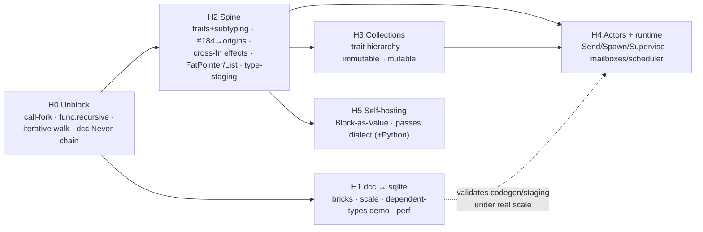

# Project Roadmap

*Strategic direction for dgen. Companion to `docs/ongoing-work.md` (the tactical
map of in-flight + planned work). This doc says **where we're going and in what
order**; that doc says **what's currently on the bench**.*

Compiled 2026-06-20 from the four stated objectives and a direction discussion.

---

## North stars

Four objectives, in no priority order — each restated in its dgen-specific shape:

1. **Actor framework** — practical, inspired by hyperactor but not bound to its
   design, with a **real in-process runtime** (mailboxes, scheduler, supervision).
   The effect system is being built *toward* this: actors are the deep, formal
   payoff of effects + linearity.
2. **dcc → sqlite** — compile real C at the scale of sqlite, and demo two things
   competitors can't easily: **performance** and **C-with-dependent-types**.
3. **Self-hosting** — express dgen's own constructs (ops, blocks, **passes**) as
   dialect-described IR, **while keeping Python authoring of passes too** (dual mode).
4. **High-level collections** — a dialect with a Scala-style trait hierarchy
   (Iterable → Seq/Set/Map), uniform polymorphic operations, and immutable +
   mutable variants.

## Locked decisions (from the direction discussion)

- **Immediate flagship: finish dcc to sqlite first.** It's the closest vertical and
  the fastest visible proof point (perf + dependent types).
- **Actors get a real in-process runtime this horizon** — mailboxes, scheduler,
  supervision on a single machine. Distribution (hyperactor-scale) is designed-for
  but out of scope for now.
- **Self-hosting = passes-as-IR *and* Python passes.** A passes dialect lands
  alongside the existing Python `Pass` API; neither replaces the other.

---

## Strategic frame: one spine, four verticals

The four north stars are not independent — they stand on a **shared foundation**.
Two foundation items dominate the leverage map:

- **Traits + type subtyping** gates collections (return-type polymorphism),
  actor supervision (effect subtyping), and self-hosting (op/trait hierarchies).
- **Origins (linear memory)** gates actor message ownership, mutable collections /
  builders, and dcc memory correctness at scale.

Behind those: `func.recursive` + iterative traversal (recursion everywhere),
FatPointer/List + the Span/value-bundle refactor (dynamic data + clean op fields),
cross-function effects (actors), and Block-as-Value + generic ops (self-hosting).

**Build the spine once; the verticals get much cheaper.** The plan therefore ships
**dcc continuously** (it needs only a thin slice of spine and keeps producing demos)
while the rest of the spine is built to serve collections, then actors, then
self-hosting.

---

## Horizons

Horizons are dependency-ordered, not calendar-bound. **H0 is prerequisite; H1 is the
immediate focus; H2 is foundation that H3–H5 draw on and can run in parallel once H0
lands.** The `→` ordering inside a horizon is hard; across horizons, H3/H4/H5 overlap.

### H0 — Unblock & de-WIP *(prerequisite)*

The minimum to let dcc reach scale and to stop the PR backlog from rotting.

- **Resolve the `call`/recursion fork** — adopt #139 (callee as operand, Option A) or
  block parameters (Option C, the doc's recommendation). *Decide before building
  recursion.*
- **`func.recursive`** (`docs/block-scoping.md` §3.1) — unblocks recursion in dcc *and*
  Toy, and recursive self-hosting passes.
- **Iterative `transitive_dependencies`** — sqlite needs deep walks without blowing the
  recursion limit.
- **Land & reconcile the dcc `Never`/early-exit chain** — order #165 → #169, fold in
  or retire #128, add the every-branch-diverges **merge elision** (#169's known gap).
- **PR triage** (see `docs/ongoing-work.md` §1) — rebase the fresh, close/rewrite the
  stale (#43, #97, #135), pick the source-of-truth for `Never`.

### H1 — dcc to sqlite *(immediate flagship)*

The first end-to-end proof point. Mostly integration + scale, little new theory.

- **Remaining C bricks** (`examples/dcc/docs/greenfield-plan.md`): struct layout
  (Brick 8), implicit conversions (Brick 9), `c_to_llvm` (Brick 10), remaining
  constructs (Brick 11).
- **Add `mod`/`shift_left`/`shift_right` to the algebra dialect** — universal integer
  ops; lets dcc drop its bespoke 3-op pass.
- **Codegen correctness blockers for scale**: `Executable.run()` lifetime bug,
  `ChainOp` type forwarding, Boolean-typed conditions, proper "is-terminator" check.
- **sqlite scale test / ratchet** (Brick 12) — coverage measurement, raise thresholds.
- **C-with-dependent-types demo** — rides the *already-working* staging engine (e.g. a C
  routine whose buffer size is a dependent type resolved at JIT time). This is the
  differentiator; it costs little because staging already does it.
- **Performance demo** — a benchmark harness comparing JIT'd output (LLVM does the heavy
  lifting); establishes the "perf" half of the dcc story.

### H2 — The type / effect / memory spine *(foundation)*

Built to serve H3–H5. Internally dependency-ordered.

1. **Traits + type subtyping** + **constraint expression evaluation** (`ExpressionConstraint`,
   `HasTypeConstraint` — today stored but skipped). *Keystone.*
2. **Memory model: #184 → origins.** Land linear `Reference` + `Buffer` (#184), then the
   full `docs/effects.md` origins design: destructor obligations, forest-based alias
   analysis, ownership transfer on return. Retire mem tokens.
3. **Effect maturation**: per-op **linearity contracts** (replace the unconditional
   "unknown" predicate), **effect subtyping** (`Raise <: Diverge`), loop-carry linearity.
4. **Cross-function effects** — lift the v1 function-local limit. *Required by actors.*
5. **Dynamic data**: FatPointer + `List` + the **Span/value-bundle refactor** (clean
   fixed-N op-field model).
6. **Staging maturity**: type staging (subsume shape inference), batch subgraph
   resolution, less pack/unpack churn.

### H3 — Collections dialect *(forces the type spine)*

The cleanest forcing function for traits/subtyping/FatPointer; low runtime risk.

- **Trait hierarchy**: Iterable → Seq/Set/Map; parameterized container types on
  FatPointer/List.
- **Uniform polymorphic ops**: map/filter/fold/flatMap, views/laziness, builder pattern
  (Scala's return-type polymorphism, expressed via subtyping).
- **Immutable persistent collections first**; **mutable + builders** once origins (H2.2)
  land (linear ownership makes in-place mutation safe).
- Produces the **mesh/gang-of-actors** type that actors consume in H4.

### H4 — Actor framework + in-process runtime *(forces the effect/runtime spine)*

The deep payoff of effects. **Real in-process runtime this horizon; distribution later.**

- **Actor effects** on the matured framework: `Send<M>`, `Spawn`, `Supervise<F>`
  (`docs/effects.md` §"Interaction with actors") — primitive ops take a handler param,
  handler-introducing ops scope it over a block.
- **Message ownership via origins** — `Send` consumes its message linearly (zero-copy,
  no aliasing), enforced by the verifier.
- **Runtime**: mailboxes, scheduler, supervision trees (single machine). *This is the
  largest piece of new, non-compiler scope on the roadmap* — a runtime library that
  actor ops lower into (runtime calls, not pure CPS, as `effects.md` anticipates).
- **Actor meshes/gangs** built on the collections dialect (H3).
- **Subsume the affine-fusion special case** with a general loop-fusion pass; keep the
  fused single-process path as an optimization, not the only model.
- Design the runtime ABI with **distribution** in mind, even though multi-host is out of
  scope now.

### H5 — Self-hosting: passes as IR *(dual mode)*

Express transformations as dialect-described IR **without** giving up Python passes.

- **Block-as-Value** + **generic ops** (`call` as a builtin; finish the op-field cleanup
  from H2.5). These also clean up the whole IR, so do the enabling cleanups early.
- **A passes dialect** — passes expressible as IR/dialect-described transformations,
  consumed by the compiler alongside Python `Pass` subclasses.
- **Spec compiler** (`dgen/spec/`) grows to emit/consume pass IR; constraint expression
  evaluation (H2.1) lets op semantics be stated formally enough to drive transforms.
- Keep the Python pass API as a first-class authoring path — dual mode, by decision.

---

## Sequencing at a glance

dcc (H1) ships first and continuously. The spine (H2) is built next and feeds the three
remaining verticals, which overlap: collections (H3) leads actors (H4) because meshes
depend on it; self-hosting (H5) rides the same op-field/Block-as-Value cleanups.

## How the 9 open PRs map to horizons

| PR | Feeds | Action |
|----|-------|--------|
| #165, #169 (dcc calls, return) | **H0/H1** | Order & land; add merge elision |
| #128 (break/continue, `Never`) | **H0** | Reconcile with #169; one source of truth for `Never` |
| #139 (call as operand) | **H0** | Decide vs Option C, then land — gates `func.recursive` |
| #184 (linear `Reference`) | **H2.2** | Rebase to current `main`; step 1 of origins |
| #102 (grad/autodiff) | Toy (off the critical path) | Rebase; land opportunistically |
| #97 (fn-ref tests + conftest) | H0 hygiene | Rebase or fold in |
| #135 (docs consolidation) | — | **Redo against current docs**, don't merge as-is |
| #43 (manim viz) | demo/marketing | Orthogonal; keep or close |

## Risks & things to watch

- **The actor in-process runtime is the biggest new scope** — it's a runtime/systems
  component, not a compiler pass. Budget for it as its own project; derisk with a
  minimal mailbox+scheduler spike before committing the full supervision model.
- **Origins is large and central.** #184 is only step 1; the alias forest + destructor
  ordering is the hard part. Mutable collections and actor messages both block on it —
  sequence it early in H2.
- **The `call`/recursion fork is overdue and cheap to decide** — every recursion-bearing
  objective waits on it. Decide in H0.
- **Doc drift** (`docs/ongoing-work.md` §4): the design docs run both ahead of and
  behind the code, and #135 would delete docs newer work cites. Fold a doc
  reconciliation into H0 rather than carrying the drift.
- **WIP is high, merges are low.** Keep the dcc chain landing to maintain momentum while
  the foundation horizons (which produce fewer visible demos) are underway.
